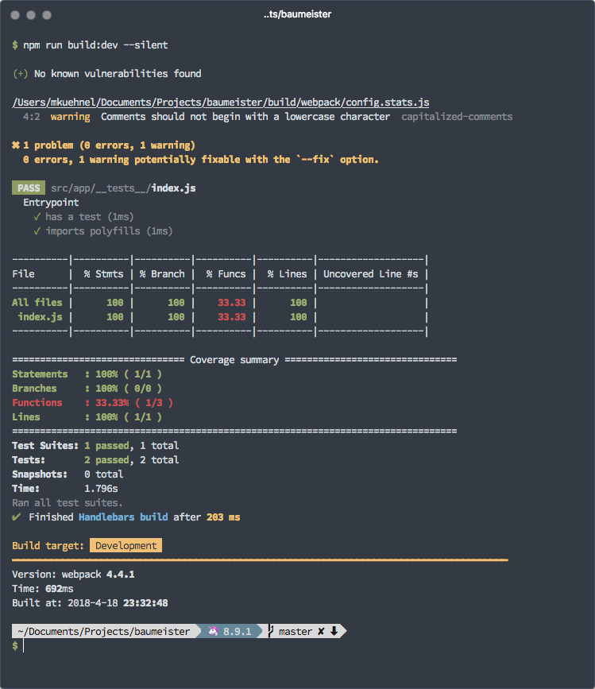
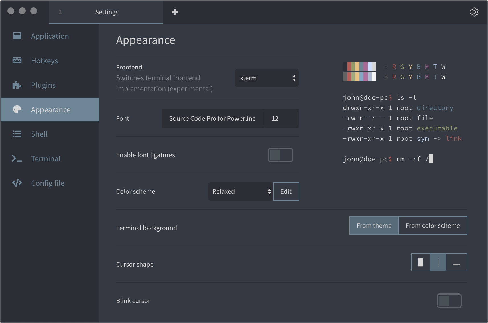

[](https://www.npmjs.com/package/hyper-relaxed)

# Relaxed

> A relaxed terminal theme to take a more relaxed view of things. For iTerm, Hyper, the macOS Terminal and a bunch of others.

Available for:

- [Hyper](#hyper)
- [iTerm](#iterm)
- [Terminal](#terminal)
- [Terminus](#terminus)
- [Additional formats](#additional-formats) (Alacritty, ConEmu, Konsole, Mutt, PuTTY, Terminator, Termite, Xfce Terminal, Xresources)

The theme only provides the colors. Please note additional usages in the screenshots: [Oh My Zsh](https://github.com/robbyrussell/oh-my-zsh), [Bullet Train for Oh My Zsh](https://github.com/caiogondim/bullet-train.zsh) and [Source Code Pro for Powerline](https://github.com/powerline/fonts/blob/master/SourceCodePro/Source%20Code%20Pro%20for%20Powerline.otf)

#### Relaxing your editor:

* [Relaxed Theme for Atom](https://github.com/Relaxed-Theme/atom-relaxed-syntax)
* [Relaxed Theme for Visual Studio Code](https://github.com/Relaxed-Theme/vscode-theme-relaxed)

## Hyper

The theme should be compatible with [Hyper](https://hyper.is/) 1.x and 2.x.



### Installation

Open your `~/.hyper.js` file (Hyper > Preferences) and add `hyper-relaxed` to the `plugins: []` array and save the file.

```js
…
plugins: ['hyper-relaxed'],
…
```

**Note:**

That’s really all you have to do. Hyper loads the plugin from the npm registry and reloads itself.

## iTerm

The theme should be compatible with all [iTerm2](https://iterm2.com/) versions.


### Installation

Download [Relaxed.itermcolors](https://gitcdn.link/repo/mischah/Relaxed/master/themes/Relaxed.itermcolors). Double click to import into iTerm.

**Note:**

- You can change the themes via
  - `iTerm > Preferences > Profiles > [Profile Name] > Colors > Color Presets …`

## Terminal

The theme should be compatible with all Terminal versions.


### Installation

Download [Relaxed.terminal](https://gitcdn.link/repo/mischah/Relaxed/master/themes/Relaxed.terminal). Double click to import into Terminal.

**Note:**

- Set the theme as default theme
  - via `Terminal > Preferences > Profile > Standard`
- Make sure to that new Terminal windows and tabs are openend with this theme
  - via `Terminal > Preferences > General`

## Terminus



### Installation

1. Go to Plugins in Settings.
1. Install `terminus-relaxed-theme` in the available plugins and restart.
1. Select »Relaxed« in the Theme Dropdown menu.
1. Go to Appearance in Settings.
1. Select »Relaxed« in the Colorscheme Dropdown menu.

## Additional formats

- [Alacritty](https://gitcdn.link/repo/mischah/Relaxed/master/themes/Alacritty/Relaxed)
- [ConEmu](https://gitcdn.link/repo/mischah/Relaxed/master/themes/Relaxed.xml)
- [Konsole](https://gitcdn.link/repo/mischah/Relaxed/master/themes/Relaxed.colorscheme)
- [Mutt](https://gitcdn.link/repo/mischah/Relaxed/master/themes/Relaxed.muttrc)
- [PuTTY](https://gitcdn.link/repo/mischah/Relaxed/master/themes/Relaxed.reg)
- [Terminator](https://gitcdn.link/repo/mischah/Relaxed/master/themes/Relaxed.config)
- [Termite](https://gitcdn.link/repo/mischah/Relaxed/master/themes/Relaxed)
- [Xfce Terminal](https://gitcdn.link/repo/mischah/Relaxed/master/themes/Relaxed.theme)
- [Xresources](https://gitcdn.link/repo/mischah/Relaxed/master/themes/Xresources/Relaxed) (xterm, (u)rxvt, and other X11 applications)

## License

Please be aware of the licenses of the components we use in this project.
Everything else that has been developed by the contributions to this project is under [MIT License](LICENSE).
