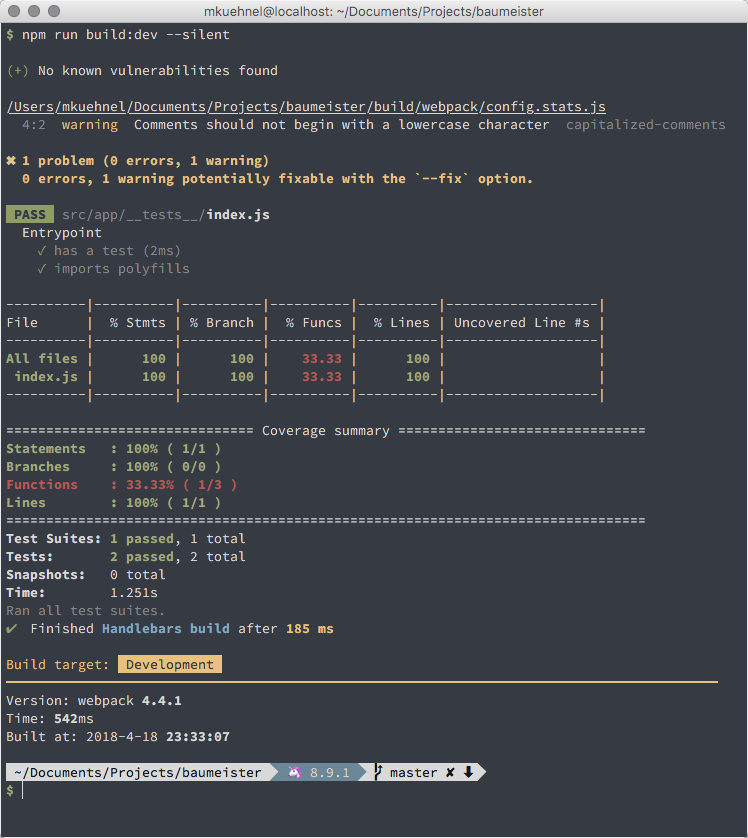
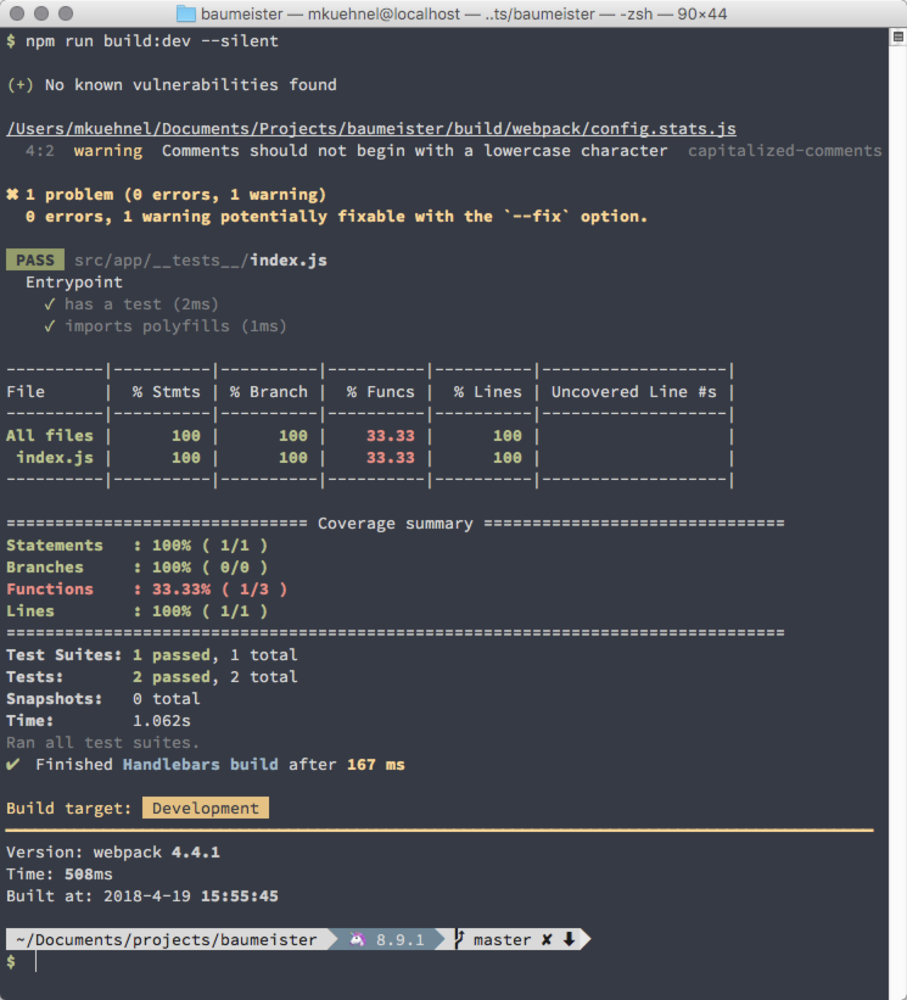

# Relaxed Afterglow

> A relaxed adaption of the Afterglow theme for iTerm and Hyper and the macOS Terminal

It was initially based on the [Afterglow iTerm Color Scheme](https://github.com/YabataDesign/afterglow-itermcolors) but evolved over time and currently has not much in common.

- [Hyper](#hyper)
- [iTerm](#iterm)
- [Terminal](#terminal)

The theme only provides the colors. Please note additional usages in the screenshots: [Oh My Zsh](https://github.com/robbyrussell/oh-my-zsh), [Bullet Train for Oh My Zsh](https://github.com/caiogondim/bullet-train.zsh) and [Source Code Pro for Powerline](https://github.com/powerline/fonts/blob/master/SourceCodePro/Source%20Code%20Pro%20for%20Powerline.otf)

## Hyper

The theme should be compatible with [Hyper](https://hyper.is/) 1.x and 2.x.


### Installation

Open your `~/.hyper.js` file (Hyper > Preferences) and add `hyper-relaxed-afterglow` to the `plugins: []` array and safe the file.

```js
…
plugins: ['hyper-relaxed-afterglow'],
…
```

**Note:**

That’s really all you have to do. Hyper loads the plugin from the npm registry and reloads itself.

## iTerm

The theme should be compatible with all [iTerm2](https://iterm2.com/) versions.



### Installation

Download [Relaxed-Afterglow.itermcolors](https://gitcdn.link/repo/mischah/Relaxed-Afterglow/master/Relaxed-Afterglow.itermcolors). Double click to import into iTerm.

**Note:**

- You can change the themes via
  - `iTerm > Preferences > Profiles > [Profile Name] > Colors > Color Presets…`

## Terminal

The theme should be compatible with all Terminal versions.



### Installation

Download [Relaxed-Afterglow.terminal](https://gitcdn.link/repo/mischah/Relaxed-Afterglow/master/Relaxed-Afterglow.terminal). Double click to import into Terminal.

**Note:**

- Set the theme as default theme
  - via `Terminal > Preferences > Profile > Standard`
- Make sure to that new Terminal windows and tabs are openend with this theme
  - via `Terminal > Preferences > General`

## License

Please be aware of the licenses of the components we use in this project.
Everything else that has been developed by the contributions to this project is under [MIT License](LICENSE).
